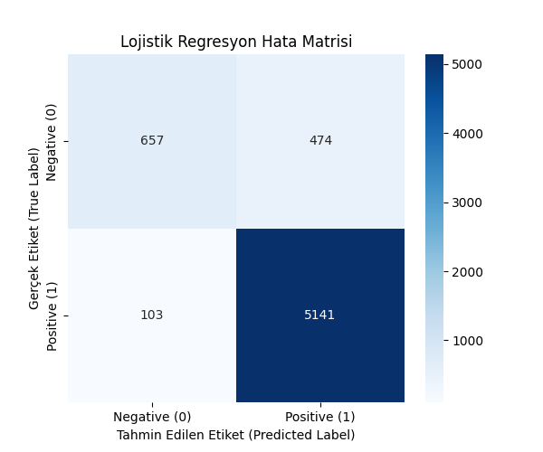

# 🚀 Türkçe Twitter Sentiment Analizi (Doğal Dil İşleme & Makine Öğrenimi)

## 🎯 Proje Hedefi

Bu proje, etiketlenmiş Türkçe tweet'ler (yorumlar) üzerinden **Doğal Dil İşleme (NLP)** teknikleri kullanılarak metinlerin duygu durumunu (**Pozitif** veya **Negatif**) otomatik olarak sınıflandırmayı amaçlamaktadır.

## 🛠️ Kullanılan Teknolojiler

* **Diller:** Python
* **Kütüphaneler:** Pandas, NLTK, Scikit-learn, Matplotlib, Seaborn
* **NLP Yöntemi:** TF-IDF Vektörleştirme (Özellik Çıkarımı)
* **Makine Öğrenimi Modeli:** Lojistik Regresyon (Logistic Regression)

## 💡 İş Akışı Özeti

1.  **Veri Temizliği:** URL, kullanıcı adı (@) ve gereksiz karakterlerin çıkarılması.
2.  **Ön İşleme (NLP):** Türkçe **Stopwords** (gereksiz kelimeler) kaldırıldı ve metinler **Tokenize** edildi.
3.  **Vektörleştirme:** Temizlenmiş metinler, **TF-IDF** (Term Frequency-Inverse Document Frequency) kullanılarak sayısal bir matrise (5000 özellik) dönüştürüldü.
4.  **Model Eğitimi:** Lojistik Regresyon modeli eğitilerek sentiment tahmini yapıldı.

## 📊 Model Sonuçları

Modelimiz, genel olarak %90'ın üzerinde doğrulukla (Accuracy) başarılı bir sınıflandırma performansı sergilemiştir.

| Metrik | Sonuç | Yorum |
| :--- | :--- | :--- |
| **Genel Doğruluk (Accuracy)** | **0.9095** | Modelin yaklaşık %91'i doğru tahmin etti. |
| **Pozitif Sınıf F1-Score** | **0.95** | Pozitif duyguları tespit etmede yüksek başarı. |
| **Negatif Sınıf F1-Score** | **0.69** | Modelin en zorlandığı kısım olan Negatif tespitte de kabul edilebilir bir skor. |

### Hata Matrisi (Confusion Matrix)

Modelin gerçek ve tahmin edilen değerlerinin karşılaştırılması:

* _Not: Confusion Matrix görselini buraya eklemek için `figures/confusion_matrix_logistic_regression.png` dosyasını kullanın._

```markdown

